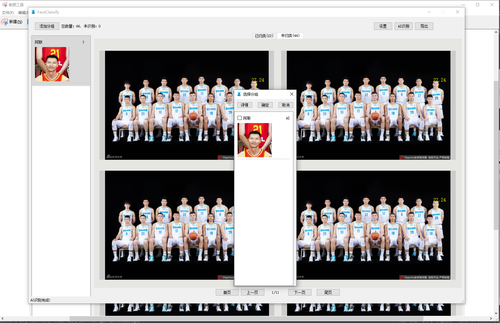
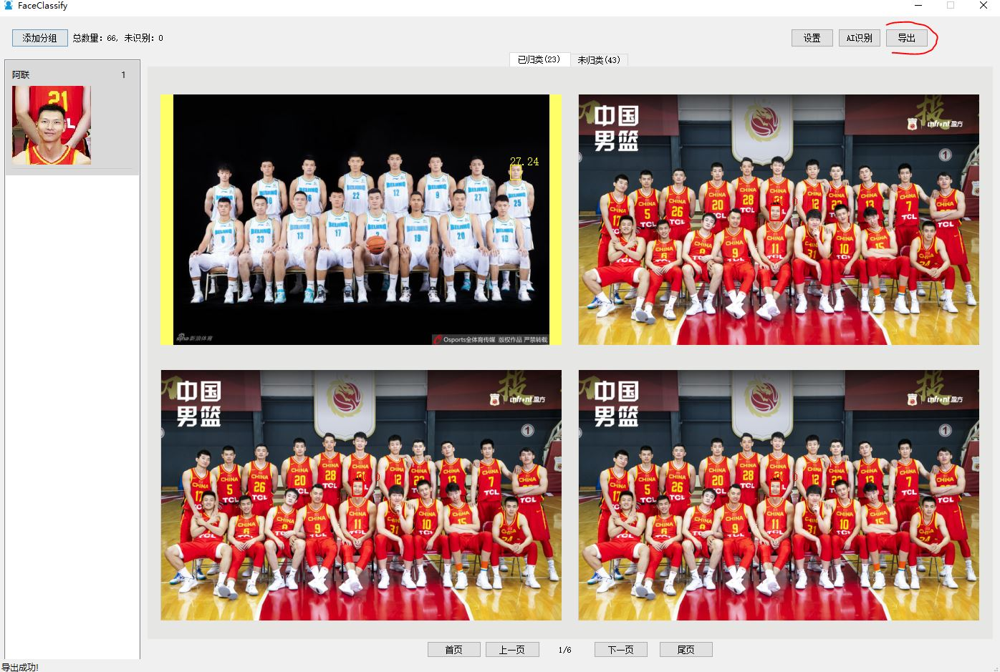

# faceclassify 是一款根据人脸相识度分类照片的软件，其内置高精度人脸识别，检测算法，同时提供了简便的可视化界面，帮助用户快速分类图片

## 1 下载
   [百度云盘地址](https://pan.baidu.com/s/1NJRu16uHdJiFkYc01U7fuA)  提取码：j6no

## 2 本地安装
   ### 下载后，本地文件为main.rar,解压main.rar,本地出现main文件夹
   
   ### 进入main文件夹里面，点击 “main.exe”, 稍等一会出现软件主界面
   
   
   
## 3 软件使用教程
   ### （1）配置系统参数。点击设置，弹出“设置”对话框，并 设置“选择人脸库”，“选择输出文件夹”和“输入文件夹”路径
   
   ### （2）导入分类图片。点击“导入”按钮,导入需要分类的所有照片, 导出成功后，主界面总数量会更新
   
   
   ### （3）添加分组。点击“添加分组”，填写组名   
   
   
   ### （4）分组添加人脸。点击人脸库管理, 弹出 “注册人脸”对话框，点击“添加”，弹出“剪切获取人脸”对话框，接着点击“人脸检测”，等待人脸检测结束后点击人脸
   
   
   
   
   

   ### （5）AI自动分组。进入主界面点击“AI识别”，左下角显示进度，运行结束后，“已归类的tab页”显示人脸相识度大于阀值的人脸（默认值80）
   
   

   ### （6）手动调整人脸相似度阀值。可以查看“未归类”人脸相似度值，设置合适的人脸相似度阀值
   
   
   
   
   ### （7）手动调整分组。对于一些复杂的场景，需要手动调整分组
   
   
   ### （8）导出
   
   
   
## 4 配置说明
   